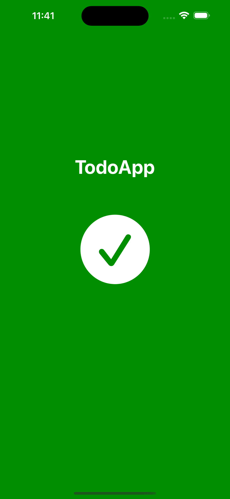
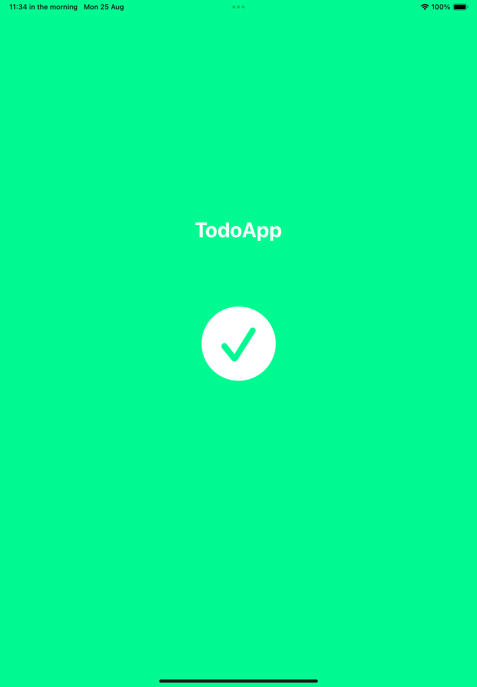
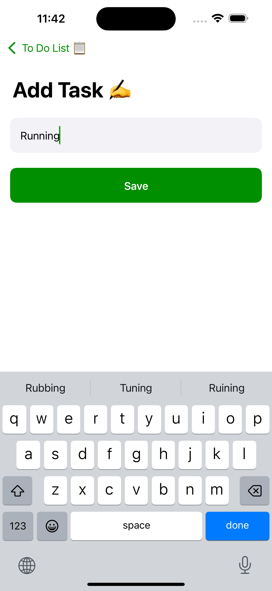
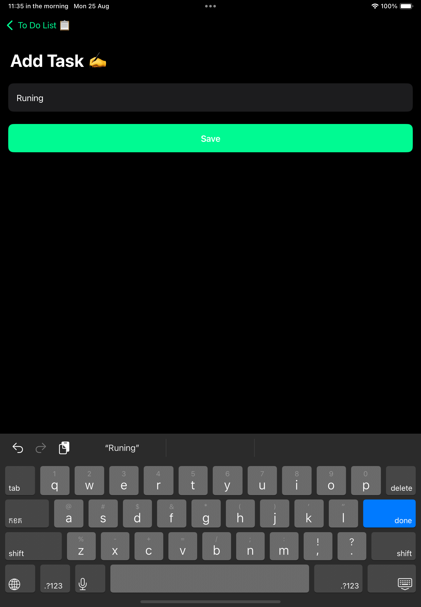
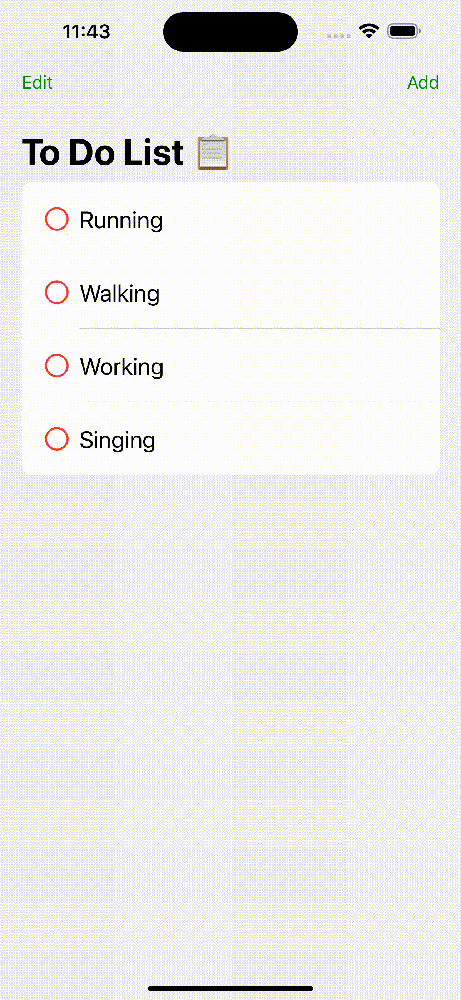
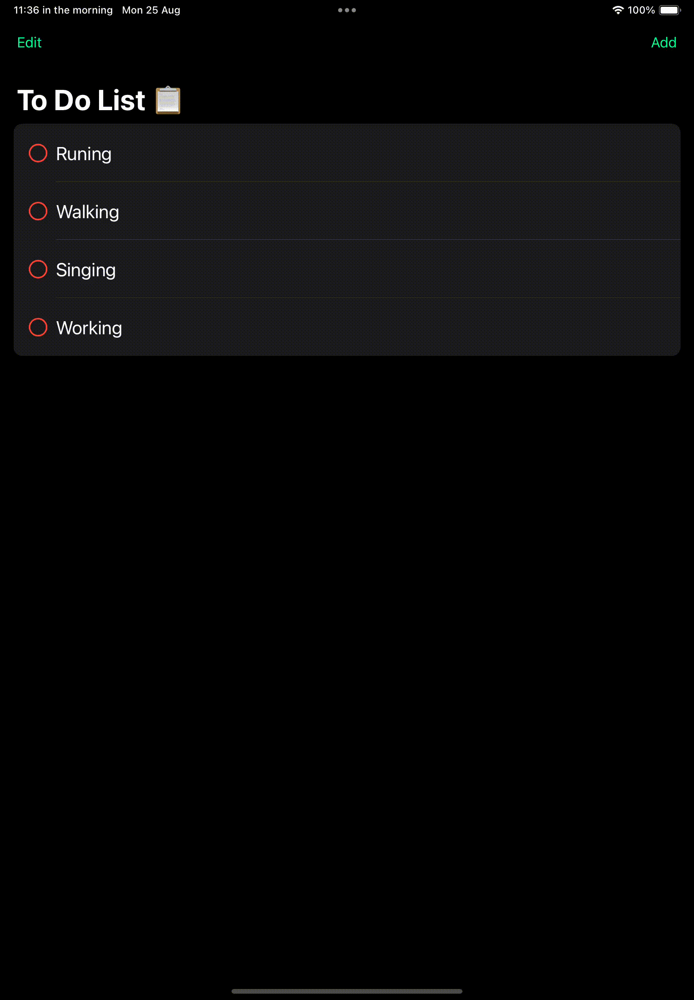
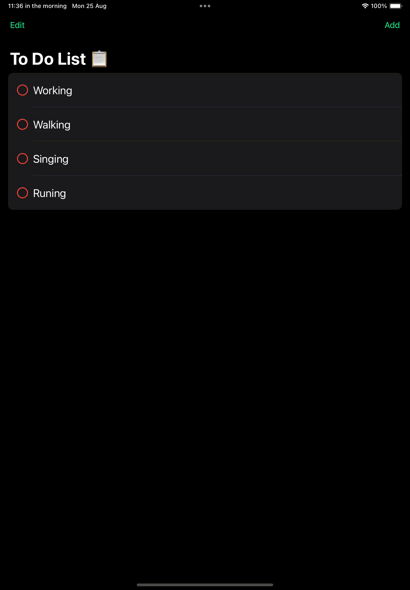
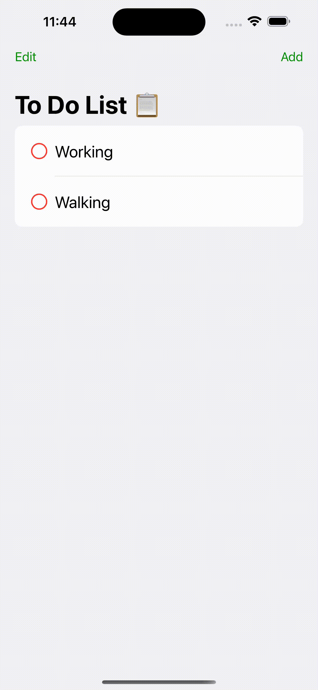
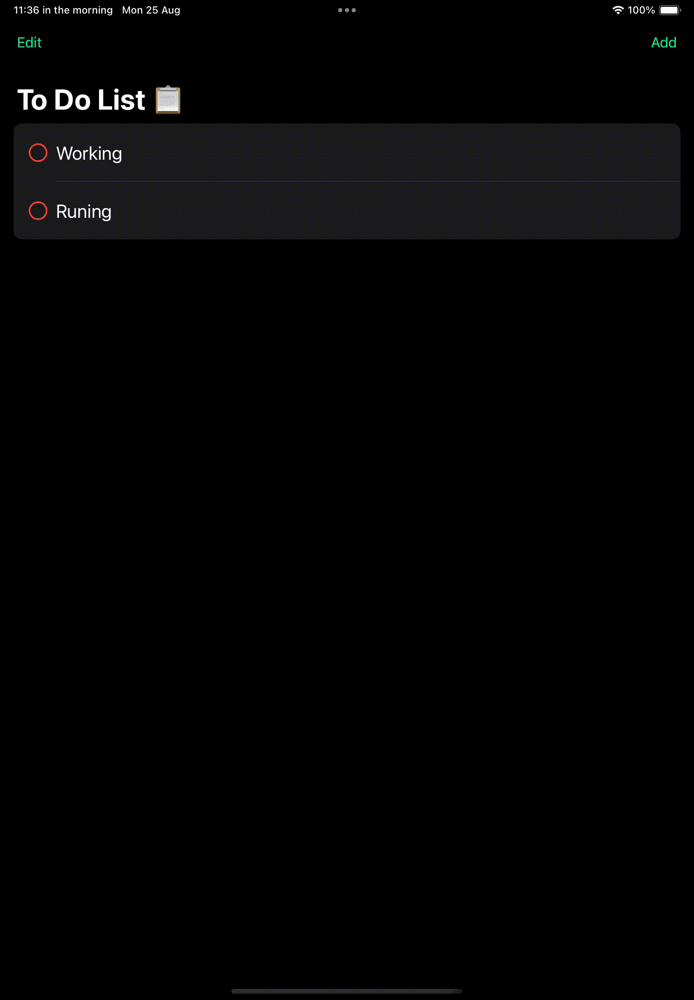

# 📱 Todo App

A simple yet powerful **Todo App** for **iPhone (Light Mode)** and **iPad (Dark Mode)**, showcasing core task management features.  
This README provides a visual walkthrough of the app's UI/UX across devices.

---

## 🎬 Demo Screens (iPhone & iPad)

| Screen          | iPhone (Light Mode)                                               | iPad (Dark Mode)                                            |
| --------------- | ----------------------------------------------------------------- | ----------------------------------------------------------- |
| 🚀 LaunchScreen |      |      |
| 📭 EmptyTask    |            |            |
| ✏️ CreateTask   |          |          |
| 🔄 MoveListTask |      |      |
| ❌ DeleteTask   |      |      |
| ✅ CheckList    |    |    |

---

## ✨ Features

- Create, check, delete, and move tasks easily.
- Smooth animations and responsive layout.
- Light mode (iPhone) and Dark mode (iPad) previews.

---

## 🚀 How to Run

1. Clone the repository
2. Open with **Xcode**
3. Run on **iPhone/iPad Simulator** or a real device

---
